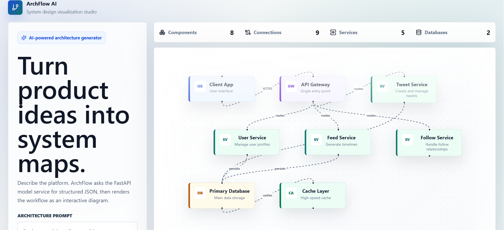

# 🏗️ ArchFlow AI — AI-Powered System Design Tool

> Turn your product ideas into interactive system architecture diagrams in seconds.


---

## 📋 Table of Contents

- [Overview](#-overview)
- [Features](#-features)
- [How It Works](#-how-it-works)
- [Tech Stack](#️-tech-stack)
- [Installation](#-installation)
- [Project Structure](#-project-structure)
- [Deployment](#-deployment)
- [Sample Prompts](#-sample-prompts-to-test)
- [Troubleshooting](#-troubleshooting)
- [Roadmap](#-roadmap)
- [Contributing](#-contributing)
- [License](#-license)

---

## 🎯 Overview

**ArchFlow AI** generates system architecture diagrams from plain-English product descriptions.

Describe a platform — e.g. *"Design a hotel booking system"* — and ArchFlow AI will:

1. 🤖 **Understand** the requirements using an AI model
2. 🧩 **Generate** appropriate microservices for the domain
3. 🔗 **Connect** those services with sensible relationships
4. 📊 **Render** an interactive, explorable architecture diagram

---

## ✨ Features

**AI-Powered Generation**
- Uses `google/flan-t5-small` to interpret the described business domain
- Produces domain-specific services rather than generic templates
- Falls back to a rule-based generator if the model call fails

**Interactive Diagrams**
- Drag-and-drop node positioning
- Zoom and pan for large architectures
- Minimap overview
- Export the diagram structure as JSON

**Smart Architecture Patterns**
- Recognizes common domains: e-commerce, social media, ride-sharing, streaming, healthcare, education, and more
- Generates the right mix of services, databases, caches, queues, and storage
- Follows standard microservices conventions

**Fully Deployable, Free Tier**
- Backend on Hugging Face Spaces
- Frontend on Vercel
- Responsive UI out of the box

---

## 🧠 How It Works

```
User Prompt                 "Design a hotel booking system"
      │
      ▼
AI Model (flan-t5-small)    Understands the domain, drafts services
      │                     e.g. Hotel Service, Booking Service, Payment Service
      ▼
Architecture Builder        Converts AI output into nodes, edges, DBs, queues
      │
      ▼
React Flow Rendering        Interactive architecture diagram in the browser
```

---

## 🛠️ Tech Stack

**Frontend**
| Technology | Purpose |
|---|---|
| Next.js 15 | React framework |
| React Flow | Interactive diagram canvas |
| Bootstrap 5 | UI styling |
| Framer Motion | Animations |
| Lucide React | Icons |

**Backend**
| Technology | Purpose |
|---|---|
| FastAPI | API framework |
| Hugging Face Transformers | AI model (flan-t5-small) |
| PyTorch | ML backend |
| Uvicorn | ASGI server |

**Infrastructure**
| Platform | Purpose |
|---|---|
| Hugging Face Spaces | Backend hosting (free tier) |
| Vercel | Frontend hosting (free tier) |

---

## 📦 Installation

**Prerequisites:** Node.js v18+, Python 3.9+, npm or yarn

**1. Clone the repository**
```bash
git clone https://github.com/Supreet37/archflow-ai.git
cd archflow-ai
```

**2. Install frontend dependencies**
```bash
npm install
```

**3. Install backend dependencies**
```bash
cd backend
python -m venv .venv
source .venv/bin/activate   # Windows: .venv\Scripts\activate
pip install -r requirements.txt
cd ..
```

**4. Set environment variables**

Create `.env.local` in the project root:
```env
NEXT_PUBLIC_API_URL=http://localhost:8000
```

**5. Run the backend**
```bash
cd backend
uvicorn main:app --reload --port 8000
```

**6. Run the frontend**
```bash
npm run dev
```

**7. Open the app**
```
http://localhost:3000
```

---

## 📁 Project Structure

```
archflow-ai/
├── app/
│   ├── layout.tsx        # Root layout
│   ├── page.tsx           # Main page with React Flow canvas
│   └── styles.css         # Custom styles
├── backend/
│   ├── main.py             # FastAPI app + AI model logic
│   ├── requirements.txt    # Python dependencies
│   ├── Dockerfile          # Container config for Hugging Face Spaces
│   └── space.py            # Hugging Face Spaces entry point
├── public/                 # Static assets
├── .env.local               # Local environment variables (not committed)
├── .gitignore
├── package.json
├── tsconfig.json
├── next.config.ts
└── README.md
```

---

## 🚀 Deployment

**Backend → Hugging Face Spaces**
1. Create a new Space at [huggingface.co/new-space](https://huggingface.co/new-space)
   - Type: Docker
   - Hardware: CPU Basic (free)
   - Template: Blank
2. Upload `backend/main.py`, `backend/requirements.txt`, and `backend/Dockerfile`
3. Wait for the build to finish
4. Your backend URL will be: `https://<your-username>-archflow-ai-backend.hf.space`

**Frontend → Vercel**
1. Push your code to GitHub
2. Import the repository at [vercel.com](https://vercel.com)
3. Add the environment variable:
   ```
   NEXT_PUBLIC_API_URL=https://<your-username>-archflow-ai-backend.hf.space
   ```
4. Deploy

---

## 📊 Sample Prompts to Test

| Prompt | Expected Services |
|---|---|
| "Design a hotel booking system" | Hotel, Booking, Payment |
| "Design a social media app" | Post, User, Feed, Follow |
| "Design an e-commerce platform" | Product, Cart, Order, Payment |
| "Design a Netflix-like platform" | Content, Recommendation, User |
| "Design an Uber-like app" | Matching, Location, Trip, Payment |

---

## 🔧 Troubleshooting

**Model download fails on Hugging Face (`ReadTimeoutError`)**
The model is ~308MB — it can take 5–10 minutes on first load. Let the build finish.

**404 on `/health`**
Confirm `main.py` defines `@app.get("/health")`, check the Space logs, and test with `curl https://your-space.hf.space/health`.

**Frontend shows generic "Service 1, Service 2" instead of domain-specific names**
This means the backend fell back to the rule-based generator because the AI call failed. Try a more specific prompt and check the Space logs for "Model loaded!".

**405 Method Not Allowed on `/generate`**
`/generate` only accepts POST requests — use `curl -X POST` or the frontend, which already sends POST.

**`npm install` is very slow**
Usually an HDD-vs-SSD issue. Move the project to an SSD if possible, or just wait it out.

**Vercel flags a vulnerable Next.js version**
```bash
npm install next@latest
git add .
git commit -m "Update Next.js"
git push
```

**Frontend still calls localhost after deployment**
Confirm `.env.local` exists locally and that `NEXT_PUBLIC_API_URL` is set in the Vercel dashboard for production, then redeploy.

---

## 🎯 Roadmap

- [ ] Support additional AI models (GPT-4, Claude)
- [ ] Export diagrams as images
- [ ] Save and share designs
- [ ] Collaborative editing
- [ ] Custom node styling
- [ ] AWS/Azure architecture icon sets

---

## 🤝 Contributing

Contributions are welcome!

1. Fork the repository
2. Create a feature branch
3. Commit your changes
4. Push to the branch
5. Open a pull request

---

## 📄 License

Released under the [MIT License](LICENSE) — free to use for personal or commercial projects.

---

- [Hugging Face](https://huggingface.co/) for free model hosting
- [Vercel](https://vercel.com/) for free frontend hosting
- [React Flow](https://reactflow.dev/) for the diagram canvas
- [Google](https://ai.google/) for the flan-t5-small model

---


⭐ If you find this useful, consider starring the repository!